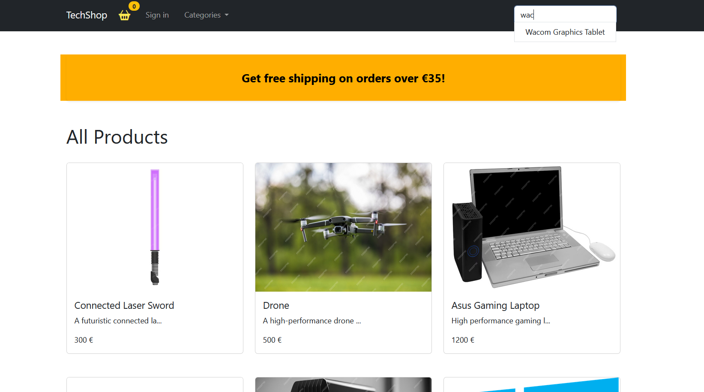
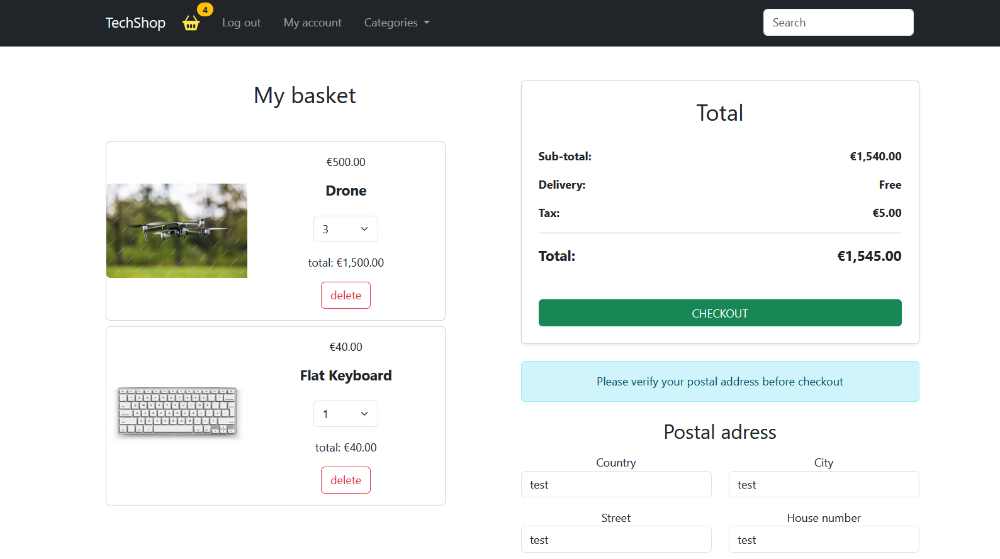

# TechShop



<hr>



<hr>

## How to run this project ?

### 1. git clone the project

### 2. Add and fill (<?>) this .env file in the root of the project:

```
POSTGRES_USER=<?>
POSTGRES_PASSWORD=<?>
POSTGRES_PORT=5432
POSTGRES_DB_URL=jdbc:postgresql://localhost:5432/ecommerce

PGADMIN_DEFAULT_EMAIL=<?>
PGADMIN_DEFAULT_PASSWORD=<?>
PGADMIN_PORT=80

# please put a HMAC256 secret type 
JWT_SECRET_KEY=<?> 
```

### 3. Run "docker compose up build -d" at the docker-compose.yml location file

### 4. Connect PgAdmin with a new server (put ipv4 info for network, then admin and password that you put in .env)

### 5. open client in Vs code, run "npm i" then "npm start"

### 6. open server in an IDE, execute the code.
